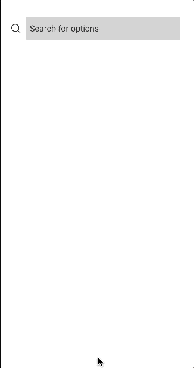

<h1 align="center">
  react-native-search-select
</h1>

<h4 align="center">
  Select objects from a searchbar
</h4>

</br>

<p align="center">
  

  <a href="https://img.shields.io/github/repo-size/Danilo-Js/react-native-search-select/commits/master">
    
  </a>
  
  
  
  
</p>

<p align="center">
  <a href="https://img.shields.io/github/issues/Danilo-Js/react-native-search-select/issues">
    
  </a>

  

  <a href="https://www.npmjs.com/package/react-native-react-native-search-bar">
    
  </a>
</p>

<p align="center" direction="row">
<a href="#information_source-about-the-project">About the project</a>&nbsp;&nbsp;&nbsp;|&nbsp;&nbsp;&nbsp;
  <a href="#rocket-getting-started">Getting Started</a>&nbsp;&nbsp;&nbsp;|&nbsp;&nbsp;&nbsp;
  <a href="#information_source-usage">Usage</a>&nbsp;&nbsp;&nbsp;|&nbsp;&nbsp;&nbsp;
  <a href="Docs/Props.md">Props</a>&nbsp;&nbsp;&nbsp;|&nbsp;&nbsp;&nbsp;
  <a href="Docs/HowToContribuite.md">How to contribute</a>&nbsp;&nbsp;&nbsp;|&nbsp;&nbsp;&nbsp;
  <a href="#memo-license">License</a>
</p>

</br>

<div style="text-align: center;">
  <div style="background-color: black; display: inline-block; padding: 20px; margin: 5px;">
    
  </div>
  <div style="background-color: black; display: inline-block; padding: 20px; margin: 5px;">
    
  </div>
</div>


</br>

## :information_source: About the project

This project was made for my final paper in the Computer Science course at UFES (Federal University of Espírito Santo). Please leave a ***STAR*** at the [repository](https://github.com/Danilo-Js/react-native-search-select) and contribute to the library.

## :rocket: Getting Started

1. Install [react-native-vector-icons](https://github.com/oblador/react-native-vector-icons#installation) along with the icon sources you want to use. In the main example, we use the `Ionicons` source. You can browse all available icon sources and their icons [here](https://oblador.github.io/react-native-vector-icons/). If you're unsure which sources you'll need, consider installing all icon sources to cover potential requirements.

2. Install this library. You can use `$ yarn add react-native-search-select` or `$ npm install react-native-search-select`

## :information_source: Usage

1. Create a folder in your project at `src/components/SearchSelect` and add a new file named `index.js` inside this folder.

2. Choose one of the usage examples from the [usage examples](Docs/UsageExamples.md), and copy the code into `src/components/SearchSelect/index.js`. You can use any of the examples as a starting point based on your needs (e.g., single-select, multi-select, paginated list).

3. Import the `SearchSelect` component into your code and use it as follows:

   ```javascript
   import SearchSelect from './src/components/SearchSelect';

    const App = () => {
      return (
        <SearchSelect
          placeholder="Search for options"
          // Other props 
        />
      );
    };

    export default App;

## :memo: License

This project is under the MIT license. See the [LICENSE](https://github.com/Danilo-Js/react-native-search-select/blob/master/LICENSE) for more information.

---

#### Made by Danilo José Lima de Oliveira

#### [Get in touch!](https://www.linkedin.com/in/danilo-js/) with me
