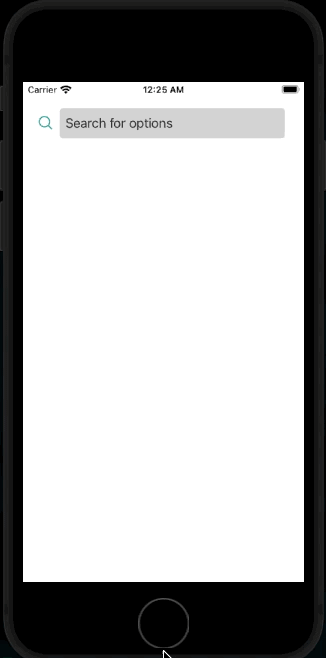
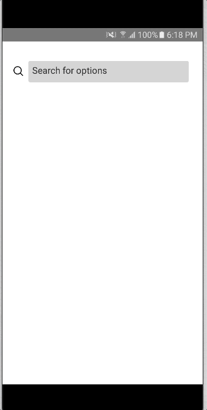

<h1 align="center">
  react-native-search-select
</h1>

<h4 align="center">
  Select objects from a searchbar
</h4>

</br>

<p align="center">
  

  <a href="https://img.shields.io/github/repo-size/Danilo-Js/react-native-search-select/commits/master">
    
  </a>
  
  
  
  
</p>

<p align="center">
  <a href="https://img.shields.io/github/issues/Danilo-Js/react-native-search-select/issues">
    
  </a>

  

  <a href="https://www.npmjs.com/package/react-native-react-native-search-bar">
    
  </a>
</p>

<p align="center" direction="row">
<a href="#information_source-about-the-project">About the project</a>&nbsp;&nbsp;&nbsp;|&nbsp;&nbsp;&nbsp;
  <a href="#rocket-getting-started">Getting Started</a>&nbsp;&nbsp;&nbsp;|&nbsp;&nbsp;&nbsp;
  <a href="#information_source-usage">Usage</a>&nbsp;&nbsp;&nbsp;|&nbsp;&nbsp;&nbsp;
  <a href="#scroll-props">Props</a>&nbsp;&nbsp;&nbsp;|&nbsp;&nbsp;&nbsp;
  <a href="#memo-license">License</a>
</p>

<p align="center" direction="row">
  <a href="#configuration-props">Configuration props</a>&nbsp;&nbsp;&nbsp;|&nbsp;&nbsp;&nbsp;
  <a href="#styling-props">Styling props</a>&nbsp;&nbsp;&nbsp;|&nbsp;&nbsp;&nbsp;
  <a href="#animation-props">Animation props</a>&nbsp;&nbsp;&nbsp;|&nbsp;&nbsp;&nbsp;
  <a href="#icon-props">Icon props</a>
</p>

</br>

<p align="center">
  
  
</p>

</br>

## :information_source: About the project

This project was made for my final paper in the Computer Science course at UFES (Federal University of Espírito Santo), where I created this public library to study the acceptance of the developer community with new proposals for reuse.

Please leave a ***STAR*** on this [repository](https://github.com/Danilo-Js/react-native-search-select) and contribute to my work.

## :rocket: Getting Started

1. Install [react-native-vector-icons](https://github.com/oblador/react-native-vector-icons#installation) and the icon sources you want. In the main example, we use `Ionicons`. You can see all the sources and its icons [here](https://oblador.github.io/react-native-vector-icons/)

2. Install this library. You can use `$ yarn add react-native-search-select` or `$ npm install react-native-search-select`

## :information_source: Usage

1. Import the library and your choosen icon source

```js
import SearchSelect from "react-native-search-select";
import Ionicons from 'react-native-vector-icons/Ionicons';
```

2. Create the options state

```js
const [options, setOptions] = useState([
  {
    key: "0",
    label: "Option 1",
    selected: false,
  },
  {
    key: "1",
    label: "Option 2",
    selected: false,
  },
  {
    key: "2",
    label: "Option 3",
    selected: false,
  },
]);
```

3. Use the library

You can use to select multiple options, like this

```js
<View style={{flex: 1, paddingTop: 35, alignItems: 'center'}}>
  <SearchSelect
    // configuration
    multipleSelect={true}
    options={options}
    setOptions={setOptions}
    showSelectedOptionsOnTop={true}
    showSelectedOptionsCounter={true}
    // animation
    animationInput="bounceIn"
    animationList="fadeInUpBig"
    // styling
    placeholder="Search for options"
    searchTextColor="blue"
    // icon
    IconSource={Ionicons}
    searchIcon="ios-search-outline"
    searchIconColor="black"
    closeIcon="ios-close-circle"
    closeIconColor="blue"
    optionSelectedIcon="ios-checkbox"
    optionSelectedIconColor="blue"
    closeTopOptionIcon="ios-close-circle-outline"
  />
</View>
```

<p align="center">
  
  
</p>

You can also use to perform an action when a option is selected, using `onSelectOption`

```js
<View style={{flex: 1, paddingTop: 35, alignItems: 'center'}}>
  <SearchSelect
    // configuration
    multipleSelect={false}
    options={options}
    onSelectOption={(index, option) => Alert.alert(option.label + ' selected!')}
    // animation
    animationInput="bounceIn"
    animationList="fadeInUpBig"
    // styling
    placeholder="Search for options"
    searchTextColor="blue"
    // icon
    IconSource={Ionicons}
    searchIcon="ios-search-outline"
    searchIconColor="black"
    closeIcon="ios-close-circle"
    closeIconColor="blue"
    optionSelectedIcon="ios-checkbox"
    optionSelectedIconColor="blue"
  />
</View>
```

<p align="center">
  
  
</p>

## :scroll: Props

### Configuration props

| Property              |                            Type                            | Required | Description                                                                                                |
| --------------------- | :--------------------------------------------------------: | :------: | ---------------------------------------------------------------------------------------------------------- |
| options               | array of { key: string; label: string; selected: boolean } |   True   | array of items to search and select                                                                        |
| setOptions            |                          function                          |  False   | function that set the value of options array                                                               |
| multipleSelect        |                          Boolean                           |   True   | if the search should allow to select multiple options or not                                               |
| showSelectedOptionsOnTop      |                          Boolean                          |  False   | boolean value that says if the selected option should appear on the top of the bar    |
| showSelectedOptionsCounter |                          Boolean                          |  False   | boolean value to show a counter of selected options. Shows nothing when there is no selected options.                               |
| onSelectOption        |                          Boolean                           |  False   | if the search should allow to select multiple options or not. Use as (selectedIndex, selectedOption) => {} |
| setIsShowingList      |                          function                          |  False   | function that sets a boolean value that says if the list is showing or not                                 |
| setHasSelectedOptions |                          function                          |  False   | function that sets a boolean value that says if there is any option selected                               |


### Styling props

| Property               |   Type    | Required | Description                                                                                     |
| ---------------------- | :-------: | :------: | ----------------------------------------------------------------------------------------------- |
| placeholder            |  String   |  False   | placeholder of the searchbar TextInput                                                          |
| placeholderTextColor   |  String   |  False   | color of the placeholder of the searchbar TextInput                                             |
| searchTextColor        |  String   |  False   | color of the text of the serch in the serachbar TextInput. It can also be set in the inputStyle |
| searchContainerStyle   | ViewStyle |  False   | style of the View that wraps the searchBar                                                      |
| itemListContainerStyle | ViewStyle |  False   | style of the View that wraps individually the result of the search                              |
| inputStyle             | ViewStyle |  False   | style of the searchbar TextInput                                                                |
| optionsOnTopContainerStyle             | ViewStyle |  False   | style of every view that wraps the selected option at the top of the bar                                                                |
| optionsOnTopTextStyle             | TextStyle |  False   | style of the text in selected options in the top of the bar                                                                |
| counterTextStyle        |  TextStyle   |  False   | style of the text of the selected options counter |
| counterContainerStyle        |  ViewStyle   |  False   | style of the view of the selected options counter |

### Animation props

| Property       |  Type  | Required | Description                                                                                                                                            |
| -------------- | :----: | :------: | ------------------------------------------------------------------------------------------------------------------------------------------------------ |
| animationList  | String |  False   | name of the choosen [react-native-animatable](https://github.com/oblador/react-native-animatable#animations-2) animation for the entrance of the list  |
| animationInput | String |  False   | name of the choosen [react-native-animatable](https://github.com/oblador/react-native-animatable#animations-2) animation for the entrance of the input |

### Icon props

| Property                |                                               Type                                               |              Required               | Description                                                                                                                                                                           |
| ----------------------- | :----------------------------------------------------------------------------------------------: | :---------------------------------: | ------------------------------------------------------------------------------------------------------------------------------------------------------------------------------------- |
| IconSource              | [React-native-vector-icons](https://github.com/oblador/react-native-vector-icons) icon component |                True                 | name of the selected source of the [React-native-vector-icons](https://github.com/oblador/react-native-vector-icons) source                                                           |
| searchIcon              |                                              String                                              |                False                | name of the icon that it will represent the search. It will be located in the right of the searchBar TextInput. It will only appears when there isn’t any item selected on the list   |
| searchIconColor         |                                              String                                              |                False                | color of the icon that represent the search. Default is 'black'                                                                                                                       |
| searchIconSize          |                                              Number                                              |                False                | size of the icon that represent the search. Default is 6% of the width                                                                                                                |
| closeIcon               |                                              String                                              |                False                | name of the icon that it will represent closing the search. It will be located in the right of the searchBar TextInput. It will only appears when there is selected items on the list |
| closeIconColor          |                                              String                                              |                False                | color of the icon that represent closing the search. Default is 'black'                                                                                                               |
| closeIconSize           |                                              Number                                              |                False                | size of the icon that represent closing the search. Default is 6% of the width                                                                                                        |
| optionSelectedIcon      |                                              String                                              | False | name of the icon that it will represent when the the individual item is selected. It will only appers at the right side of the selected item                                          |
| optionSelectedIconColor |                                              String                                              |                False                | color of the icon when the option is selected. Default is 'black'                                                                                                                     |
| optionSelectedIconSize  |                                              Number                                              |                False                | size of the icon when the option is selected. Default is 6% of the width                                                                                                              |
| closeTopOptionIcon      |                                              String                                              | False | name of the icon that it will represent when an option at the top of the bar will be deleted                                          |
| closeTopOptionIconSize  |                                              Number                                              |                False                | size of the icon the icon that it will represent when a selected option at the top of the bar will set as unselected |
| closeTopOptionIconColor |                                              String                                              |                False                | color of the icon the icon that it will represent when a selected option at the top of the bar will set as unselected  |
## :memo: License

This project is under the MIT license. See the [LICENSE](https://github.com/Danilo-Js/react-native-search-select/blob/master/LICENSE) for more information.

---

#### Made by Danilo José Lima de Oliveira ♥

#### [Get in touch!](https://www.linkedin.com/in/danilo-js/) with me
